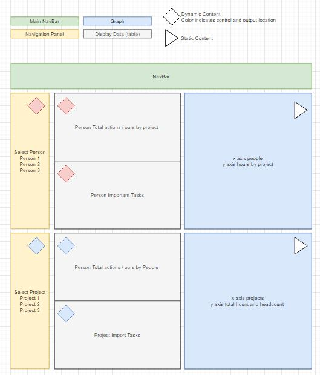
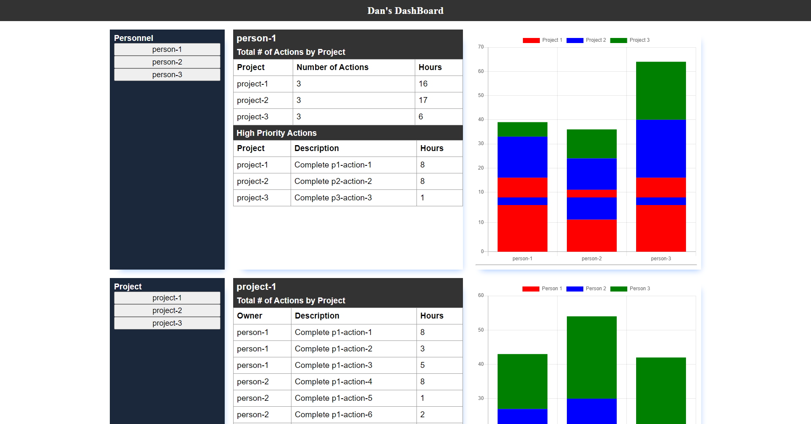

# theweek
This site can combine action item lists into a dashboard that everyone can understand. This allows managers to see which shared resources are overbooked and prioritize as necessary. This also allows individuals to keep track of the actions they get from different projects.

##### Live Site at
https://2stash.github.io/dashboard/

##### How to use
1) Create excel files that have the follow columns, with the exact names
  ID
  Project
  Priority
  Owner
  Description
  Hours

2) Name excel tab the project name

3) Upload file(s) by clicking "Choose Files"  (I'm not sure what the number of files limit is, and this is just a demo so the data is not saved yet. Going to add ability to include multiple tabs soon, and save and store data)

4) Click Build Dashboards

5) If any problems refresh the browser to reset it. 

##### Use Cases
* If you use action item lists in excel to track your teams action and want to have a dashboard display this data. 
* If you want to implement scrum and you want an easy transition, and you use excel to track actions. If you have long list of actions for long duration projects, you can save the tasks that need to get done this week into a new file, ad hours and track progress across multiple teams.
* If you need visibility into shared resources workload. A shared resource is someone who is usually on multple tasks doing same function. These people are usually overlooked when making schedules and resource allocation.
* If your company thinks that using Microsoft Project Schedules is a good idea and that you need to manage a resource and cost loaded schedule with 6000 lines, and they don't give you adequate resources to even keep it up to date. This can be used to ensure work gets done, and then in your freetime update the MS Schedule, or hope the program ends before anyone notices.

##### Future Updates (Soon! Before Jan 1, 2022)
* Better styling.
* Save data to local storage.
* Add filtering to data.
* Create backend.
* Create login.
* Add feature to save weekly data.

##### User Feedback
User feedback is important! I opened a discussion tab so features can be requested and discussed easily.

##### WireFrame Full-screen

##### Development Pictures
